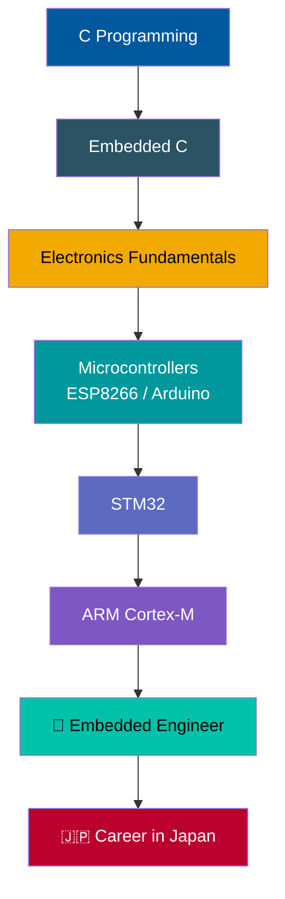

<!-- ============================================================
  HOW TO USE
  1. Create a public repo named EXACTLY your GitHub username
  2. Add this file as README.md
  3. Search for "YOUR_USERNAME" and replace it (appears several times)
  4. Search for "TODO" and fill in the gaps
============================================================ -->

 

---

## 👋 About Me

I'm **Praveen Kumar**, an Electronics & Communication Engineering (ECE) student who loves the moment code meets hardware, when a few lines of C make a real circuit come alive.

- 🎯 **Goal:** Become a professional **Embedded Systems Engineer**
- 🇯🇵 **Long-term dream:** Build my career in **Japan**
- 🔭 **Currently:** Going deep into C, Embedded C and electronics fundamentals
- 🛠️ **Hands-on with:** ESP8266, Arduino and basic electronics
- 📚 **Learning in public:** This profile doubles as my personal learning log

> *"First make it work, then make it right, then make it small and fast."*

---

## 🧰 Tech Stack & Tools

**Languages**

**Hardware & Platforms**

**Tools**

### 📊 Skill Level (honest self-assessment)

| Skill | Level | Progress |
|---|---|---|
| C Programming | Learning fundamentals |  |
| Embedded C | Getting started |  |
| Basic Electronics | Building foundations |  |
| ESP8266 / Arduino | Hands-on projects |  |
| Git & GitHub | Comfortable |  |
| HTML / CSS | Basic |  |
| STM32 / ARM Cortex-M | Upcoming |  |

Update these numbers as you grow. Seeing them climb is the fun part.

---

## 🗺️ Learning Roadmap

| Stage | Status |
|---|---|
| C fundamentals | 🟡 In progress |
| Embedded C | 🟡 In progress |
| Electronics basics | 🟡 In progress |
| Microcontrollers (ESP8266, Arduino) | 🟢 Hands-on |
| STM32 | ⚪ Planned |
| ARM Cortex-M | ⚪ Planned |
| Job-ready portfolio + interview prep | ⚪ Planned |

---

## 🚀 Featured Projects

### 🌡️ [environmental-monitor](https://github.com/YOUR_USERNAME/environmental-monitor)
> An ESP8266-based environment monitoring node with a live web dashboard.

- **Tech:** ESP8266 · C/Embedded C · HTML/CSS
- **What it does:** TODO (e.g. reads temperature/humidity and shows it on a web page)
- **What I learned:** TODO (e.g. sensor interfacing, Wi-Fi, serving web pages from a microcontroller)

<!-- Add a demo GIF: create an assets/ folder and uncomment the line below

-->

---

### 🏠 [home-automation-hub](https://github.com/YOUR_USERNAME/home-automation-hub)
> A central hub to control home devices from a web interface.

- **Tech:** ESP8266 · C/Embedded C · HTML/CSS
- **What it does:** TODO (e.g. control relays/lights from a browser)
- **What I learned:** TODO (e.g. GPIO control, hosting a control panel, handling requests)

<!--  -->

---

### 🤖 [rtos-sentry-robot](https://github.com/YOUR_USERNAME/rtos-sentry-robot)
> A sentry robot exploring real-time task scheduling concepts.

- **Tech:** C/Embedded C · RTOS concepts · HTML/CSS
- **What it does:** TODO (e.g. runs sensing and control as separate tasks)
- **What I learned:** TODO (e.g. tasks, timing, concurrency on a microcontroller)

<!--  -->

---

## 📓 Learning Log

*A running record of what I've learned and built. Newest first.*

| Date | What I learned / built | Notes |
|---|---|---|
| TODO | Started the structured C → Embedded C study plan | Focus: pointers, memory, bit manipulation |
| TODO | Finished 3 ESP8266 projects | Added web dashboards for each |
| TODO | Set up GitHub profile | You're looking at it 🙂 |

### 🎯 Current Goals

- [x] Build 3 ESP8266 projects
- [ ] Master C fundamentals (pointers, structs, memory, bitwise operations)
- [ ] Build strong Embedded C habits (registers, volatile, interrupts)
- [ ] Learn electronics fundamentals (Ohm's law, transistors, ADC, communication protocols)
- [ ] Move to STM32 and understand ARM Cortex-M basics
- [ ] Polish portfolio and prepare for interviews
- [ ] Work as an Embedded Systems Engineer 🇯🇵

---

## 📈 GitHub Stats

 

---

## 🇯🇵 Why Japan?

Japan is a world leader in embedded systems, from automotive electronics and robotics to consumer devices and precision manufacturing. I want to learn from that engineering culture of quality, discipline and craftsmanship, and contribute to it. I'm also planning to learn Japanese alongside my technical skills.

> 🌸 *コツコツ努力 (kotsukotsu doryoku): steady, consistent effort.*

---

## 🤝 Let's Connect

 

*Always happy to talk about embedded systems, share notes, or learn from someone further along the path.*

